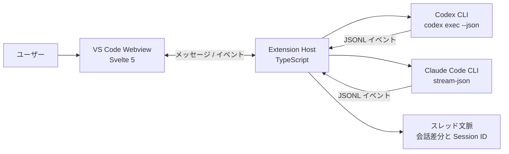
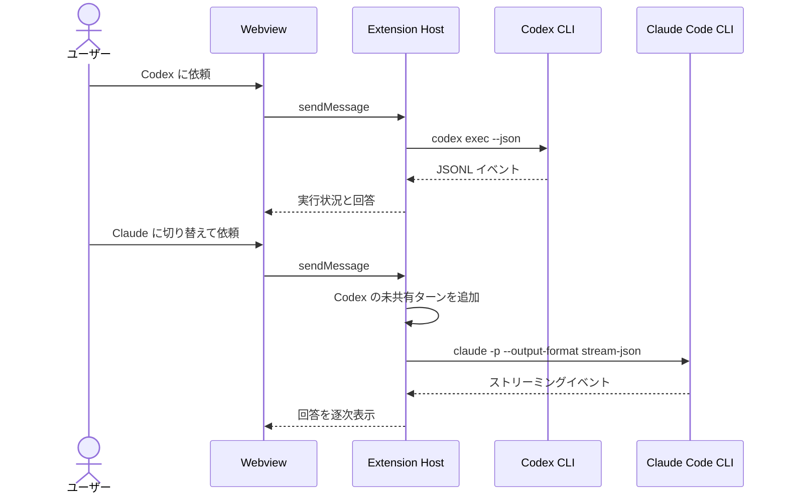

# Claude Codex Orchestrator

<p align="center">
  
</p>

VS Code の同じチャット画面から Codex CLI と Claude Code CLI を切り替えて使う、個人向けのオーケストレーション拡張機能です。AI を切り替えたときは、それまでの会話差分を次の AI に渡すため、作業の流れを保ったまま役割を交代できます。

> [!NOTE]
> 現在は開発初期版（`0.0.1`）です。セッションとメッセージはチャットパネルを閉じると破棄されます。

## 主な機能

- VS Code で開いているワークスペースをプロジェクト一覧に表示
- プロジェクトごとにチャットパネルを起動
- Codex / Claude を画面上のトグルで切り替え
- 各 CLI のセッション ID を引き継いで会話を継続
- AI 切り替え時に、相手がまだ見ていない会話差分をプロンプトへ追加
- Codex のコマンド実行・ファイル変更・完了状態を表示
- Claude の応答をストリーミング表示し、ツール利用も表示

## 仕組み



AI を切り替えた場合の流れは次のとおりです。



## 必要なもの

- VS Code `1.90.0` 以上
- Node.js と npm
- インストール・認証済みの [Codex CLI](https://developers.openai.com/codex/cli/)
- インストール・認証済みの Claude Code CLI

拡張機能は認証情報を保存せず、各 CLI の既存の認証をそのまま利用します。

## 開発環境で試す

```bash
git clone https://github.com/syunsukeN/claude-codex-orchestrator.git
cd claude-codex-orchestrator
npm install
npm run build
```

このフォルダーを VS Code で開き、`F5` を押して Extension Development Host を起動します。

## 使い方

1. Extension Development Host で作業対象のフォルダーを開きます。
2. Activity Bar の Claude Codex Orchestrator アイコンを選びます。
3. `Projects` に表示されたプロジェクトをクリックしてチャットを開きます。
4. `Codex` または `Claude` を選び、メッセージを送信します。
5. 必要に応じて AI を切り替えます。直前までの経緯は自動的に次の AI へ渡されます。

各 CLI は選択したプロジェクトのパスをカレントディレクトリとして実行されます。ファイル変更やコマンド実行を依頼する場合は、対象プロジェクトの内容が変更される可能性があります。

## VSIX を作る

```bash
npx @vscode/vsce package
code --install-extension claude-codex-orchestrator-0.0.1.vsix
```

## 開発コマンド

| コマンド | 内容 |
| --- | --- |
| `npm run build` | Extension Host と Webview をビルド |
| `npm run watch:extension` | Extension Host を監視ビルド |
| `npm run test:unit` | Vitest の単体テストを実行 |
| `npm run test:integration` | VS Code 上の統合テストを実行 |
| `npm test` | 単体テストと統合テストを順番に実行 |

## ディレクトリ構成

```text
src/
├── extension/    # VS Code API、CLI 実行、イベント解析、文脈管理
├── shared/       # Extension Host / Webview 間の共有型
└── webview/      # Svelte 製チャット UI
test/
├── unit/         # Vitest 単体テスト
└── integration/  # VS Code Extension Host 統合テスト
resources/        # 拡張機能アイコン
```

## 現在の制約とロードマップ

- 同時実行はチャットパネルごとに 1 件です。
- チャットパネルを閉じるとセッションと履歴は失われます。
- 複数スレッドの切り替え UI は未実装です。
- 今後、スレッドの永続化、自動レビュー、複数スレッド管理を追加する予定です。

## ライセンス

UNLICENSED — All Rights Reserved. 詳細は [LICENSE](LICENSE) を参照してください。
